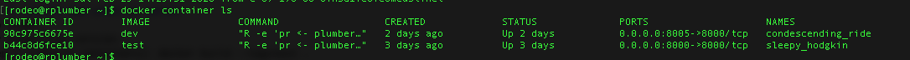
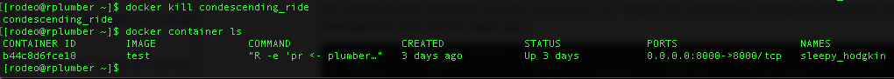
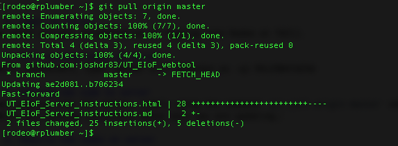
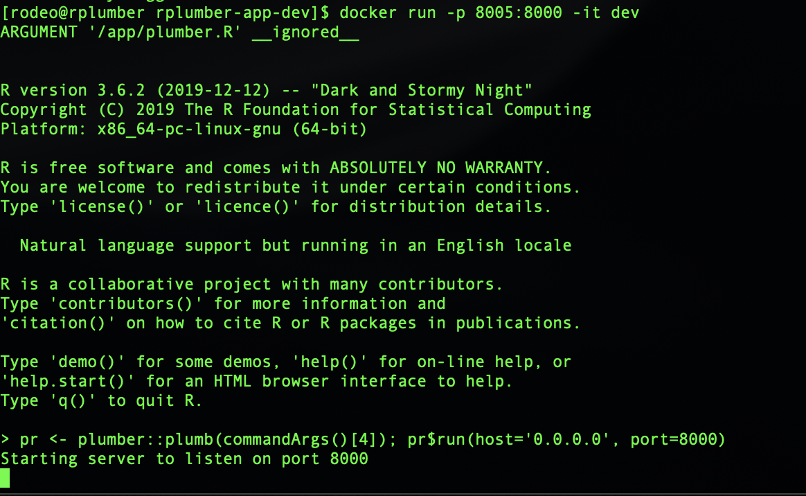

# UT-Austin Energy Institute Energy Infrastructure of the Future (EIoF) Project current server instructions

**note that these will change when the code is moved to another non-UT system**

## Project purpose
The EIoF project seeks to build a tool that allows users to make large-scale changes to how and what types of energy are consumed in the US economy and then quickly see the implications of those choices. The tool consists of two parts 1) a publicly-available website where users can make simple changes to how different regions in the US consume energy and 2) a suite of codes (programmed in R) running on a remote server that process the users choices and send back answers that are displayed on the aforementioned website (henceforth called the *codes*). 

## Website
The website is currently being developed by the Faculty Technology Studio at UT-Austin. The test version can be found here: TBD

## Current code location
The code is currently located on TACC's Rodeo system at the IP address: `129.114.6.122` and are accessed via the command line or terminal in Linux/Mac, or via the BASH plug in for Windows 10. It is unclear if they can be accessed with earlier versions of Windows. Basic Linux command knowledge will be assumed, some basics can be learned here: https://www.guru99.com/must-know-linux-commands.html

*Carey to put Windows terminal/BASH installation instructions for this document*

Currently, the system is accessed through a `.pem` file that has been provided by David Walling (TACC). The code itself can be accessed two ways 1) through the GUI <a href="https://cyberduck.io/" target="_blank">Cyberduck</a>, which allows for the dragging and dropping of files between ones computer and the server directly or 2) through GitHub. The latter is the preferred work flow as GitHub will keep track of changes (like track changes in MS Word) and we can revert back to an earlier version if needed. For now, the codes are accessed via the command line (in Linux and MacOS) via the Terminal command line via this call:

`ssh -i ~/.ssh/rplumber.pem rodeo@129.114.6.122`

Note that the `rplumber.pem` file is in a particular location: `~/.ssh`. Folders that are proceeded with a `.` are known as hidden folders and you might need to change your computer settings to see or access them. 

There are two versions of the code on the server and the GitHub repository, one called `rplumber-app` and the second called `rplumber-app-dev`. The codes in the `rplumber-app` folder are the *production codes* and the ones in the codes in the `rplumber-app-dev` folder are the *test codes*. In general, only minor bug fixes and code changes should be pushed to the production codes and major changes should first be tried in the `rplumber-app-dev` test codes to make sure they don't mess things up.

Be careful when editing the codes as the login gives the user sudo (root or administrator privileges). 

*Note: the location of the codes will change at some point to move off of UT's network to a third-party server service such as Amazon Web Services*

## Current code editing work flow
There are multiple ways of doing this, below is a simple method that allows each of us to make changes to the master code set. If this were a large project with many collaborators, there would be one person in control of the master code and others would <a href="https://gist.github.com/Chaser324/ce0505fbed06b947d962" target="_blank">fork</a> (create their own versions of) the code and then push them to the master code and have them approved by the administrator.  

The current work flow of changing the code on the server is as follows:

0. Clone the repository to your computer. (only have to do this the first time)
1. Use R Studio to pull down the codes to make sure that you have the most up-to-date version to work from. (see below)
2. Make edits and test to make sure codes are running locally.
3. Close and restart RStudio and rerun codes to make sure that you have all of the right packages installed in the codes themselves.
4. Push new codes to GitHub (see below)
5. Login to server
6. Kill running codes on server
7. Pull new codes to server via git commands (see below)
8. Rebuild new codes (see below)
9. Launch new codes (see below)

### 0. Clone the repository to your computer.
*You only do this step once at the beginning.* 
This <a href="https://happygitwithr.com/rstudio-git-github.html" target="_blank">tutorial</a> walks you through how to connect your local computer to a repository on GitHub through RStudio. Go through the dummy example first and then create one off of the <a href="https://github.com/joshdr83/UT_EIoF_webtool" target="_blank">repository</a> that I have setup for the project.

*@Carey -- if you want to set up an EI GitHub for the project, just let me know and we can move it off my personal GitHub page.*

### 1. Pull down existing codes from GitHub
The first step when editing the codes is to pull down the most recent version from GitHub. In RStudio, you start by clicking the blue down arrow under the *Git* tab in the upper right hand corner of the default RStudio layout. 

Doing so will let you know if there are any things that will be changed. In the below image it shows that there were two changes to the `UT_EIoF_Server_Instructions.md` document, one insertion (new stuff) and one deletion.

*Warning!* Doing this update changes the `UT_EIoF_Server_Instructions.md` on my computer. 

### 2. Make you local edits to the codes and make sure that they run

This is the normal process that you would follow when making changes to your code. Make sure they run first! 

*If you find that you have to use a new R package that is not in the list that have already been installed on the server, first, try to do it a different way, because we will have to make changes to the container codes themselves. See updating container codes.*

### 3. Restart RStudio and run your code from scratch.

Sometimes you can have a variable or data frame defined in your local universal environment that lets your code run, but you forgot to define it in the codes you are working on themselves. Restarting RStudio and running your codes right away will find these errors.

### 4. Sending new code to GitHub  

Note: DO NOT PUSH UNFINISHED OR NON-WORKING CODES TO THE GITHUB REPO!! WAIT UNTIL YOU HAVE SOMETHING THAT WORKS.

Once you have made edit to code that you would like to push to the server, you should follow these steps:

1. Commit changes
2. Leave a message...
3. Push changes to GitHub

When you make a change to a file (and save it) in the directory where you keep the codes (and it is not in the .gitignore file), it will whow up in the upper right hand corner of the RStudio window under the Git tab. If you want to send that changed file to GitHub and the server, you must first stage and commit those changes. You can stage the changes by checking the box next to the file in the Git pane.

One you have checked all the files you wish to send to GitHub, you must commit them. It is best practive to leave a short message that explains the changes you made. Keep it short, do not put code in here. If you highlight one of the files you are sending, it will show you the changes you have made. Red = deletions, green = additions:

Once have typed the message, click the `Commit` button below the message.

At this point, you probably think that you are done and your shiny new codes are on the world wide webs, but you are wrong, they are not. There are more (easy to forget steps). The below image shows a hard-to-see message on the top left that says *Your branch is ahead of 'origin/master' by 1 commit*. We must fix that. You must now *Push* the changes by clicking on the green up arrow on the top right of this window pane.

Once you do that, your shiny new codes now really are on the world wide webs (GitHub) and can then be pulled down to the remote server!

### 5. Login to server
(see other private documentation on logging into Rodeo at TACC).

### 6. Kill running codes on server

When you are ready to update codes on the server, you will first need to kill any running instances of that code first. You can see what all codes are running by the command `docker container ls`. Usually the code that is running the production version will be called `test` and the development code will be called `dev`.

To kill a running container, just type: `docker kill container_name`

### 7. Getting new code to server  
After logging into the server, simply using the command `git pull origin master` will move the new codes from the GitHub site to the server. It is likely best to kill any running containers whose data you are updating.

### 8. Rebuild new codes on server 
Once you have new codes on the server, you can rebuild the containers (make sure you have killed the running one first). *If you have added any new R packages to the codes that you have uplodaed, you must also update the containers themselves. See Updating_containter_codes.md*

To rebuild the containers, navigate to the directory with the code you want to run (for the `dev` codes, `/home/rodeo/rplumber-app-dev`), and type the following: 

`docker build --tag=dev .` 

where `dev` is what you want to call the new deployed code -- you will need to use this same name when you deploy or launch the new codes to be accessiable to the FTS website. For now, we are calling the development code `dev` and the production code `test`: (`docker build --tag=test .`)  

If you end up with an error during build such as "thin pool has 152356 free data blocks which is less than required", then delete old docker images (you can view them by "docker image ls") using the command such as "docker rmi 4f02536de3d4" where 4f02536de3d4 is the Image ID.  You can also use "docker container prune" to "prune" old images not assocaited with any active containers.  By running “docker info” you can see a value for “Thin Pool Minimum Free Space: 10.74 GB” (for example) and I think you are OK if you have “Data Space Available: 12.23 GB” (for example) that is larger than “Thin Pool Minimum Free Space”.

### 9. Launch new codes on server 
After the new codes have been built, they will need to be launched. This can be done immediantly after rebuilding them. For the produciton version, (tagged `test`):

`docker run -p 8000:8000 -it test`

Will launch the production codes on port 8000 (this matters for how the code it reached by the outside world).

And to launch the developmet code on port 8005: `docker run -p 8005:8000 -it dev`

Once you start the container, you will be viewing the terminal as if you are watching the R code (e.g., when you call the code from teh website, you will see the comments embedded in the underlying R code).  If you want to leave the container operating, but perform more commands in UNIX, type ctrl+p and ctrl+q after each other, and you will go back to a prompt.
