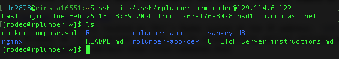
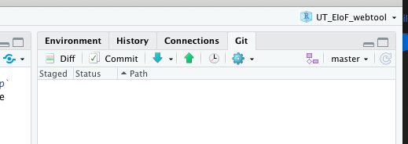
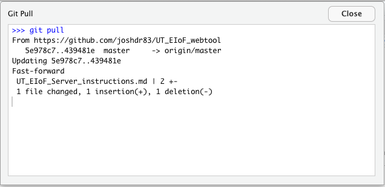
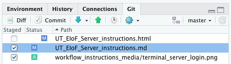
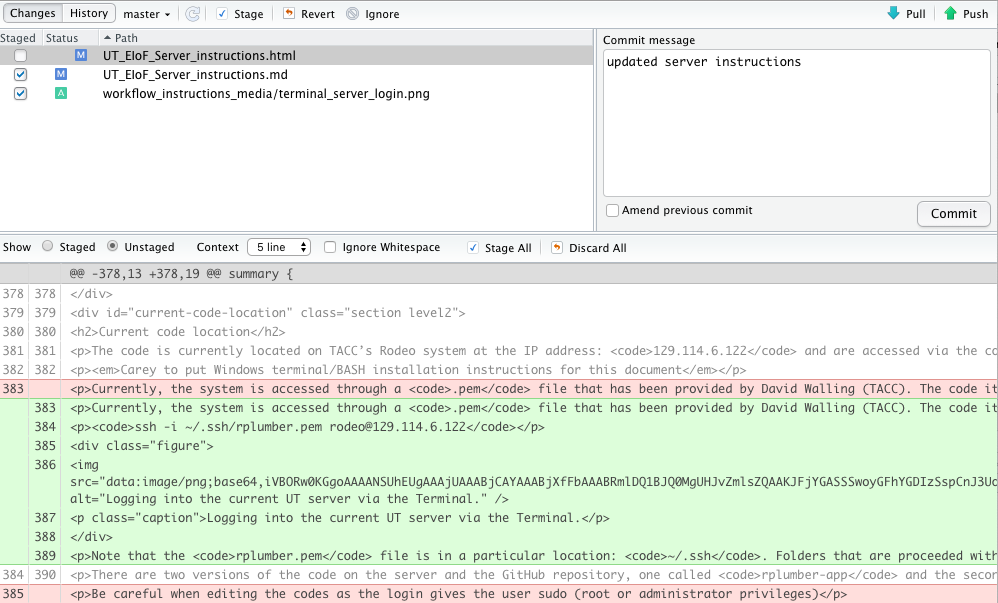
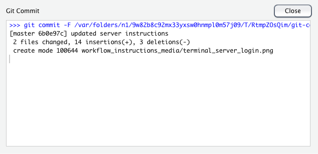

# UT-Austin Energy Institute Energy Infrastructure of the Future (EIoF) Project current server instructions

**note that these will change when the code is moved to another non-UT system**

## Project purpose
The EIoF project seeks to build a tool that allows users to make large-scale changes to how and what types of energy are consumed in the US economy and then quickly see the implications of those choices. The tool consists of two parts 1) a publicly-available website where users can make simple changes to how different regions in the US consume energy and 2) a suite of codes (programmed in R) running on a remote server that process the users choices and send back answers that are displayed on the aforementioned website (henceforth called the *codes*). 

## Website
The website is currently being developed by the Faculty Technology Studio at UT-Austin. The test version can be found here: TBD

## Current code location
The code is currently located on TACC's Rodeo system at the IP address: `129.114.6.122` and are accessed via the command line or terminal in Linux/Mac, or via the BASH plug in for Windows 10. It is unclear if they can be accessed with earlier versions of Windows. Basic Linux command knowledge will be assumed, some basics can be learned here: https://www.guru99.com/must-know-linux-commands.html

*Carey to put Windows terminal/BASH installation instructions for this document*

Currently, the system is accessed through a `.pem` file that has been provided by David Walling (TACC). The code itself can be accessed two ways 1) through the GUI <a href="https://cyberduck.io/" target="_blank">Cyberduck</a>, which allows for the dragging and dropping of files between ones computer and the server directly or 2) through GitHub. The latter is the preferred work flow as GitHub will keep track of changes (like track changes in MS Word) and we can revert back to an earlier version if needed. For now, the codes are accessed via the command line (in Linux and MacOS) via the Terminal command line via this call:

`ssh -i ~/.ssh/rplumber.pem rodeo@129.114.6.122`

Note that the `rplumber.pem` file is in a particular location: `~/.ssh`. Folders that are proceeded with a `.` are known as hidden folders and you might need to change your computer settings to see or access them. 

There are two versions of the code on the server and the GitHub repository, one called `rplumber-app` and the second called `rplumber-app-dev`. The codes in the `rplumber-app` folder are the *production codes* and the ones in the codes in the `rplumber-app-dev` folder are the *test codes*. In general, only minor bug fixes and code changes should be pushed to the production codes and major changes should first be tried in the `rplumber-app-dev` test codes to make sure they don't mess things up.

Be careful when editing the codes as the login gives the user sudo (root or administrator privileges). 

*Note: the location of the codes will change at some point to move off of UT's network to a third-party server service such as Amazon Web Services*

## Current code editing work flow
There are multiple ways of doing this, below is a simple method that allows each of us to make changes to the master code set. If this were a large project with many collaborators, there would be one person in control of the master code and others would <a href="https://gist.github.com/Chaser324/ce0505fbed06b947d962" target="_blank">fork</a> (create their own versions of) the code and then push them to the master code and have them approved by the administrator.  

The current work flow of changing the code on the server is as follows:

0. Clone the repository to your computer. (only have to do this the first time)
1. Use R Studio to pull down the codes to make sure that you have the most up-to-date version to work from. (see below)
2. Make edits and test to make sure codes are running locally.
3. Close and restart RStudio and rerun codes to make sure that you have all of the right packages installed in the codes themselves.
4. Push new codes to GitHub (see below)
5. Login to server
6. Kill running codes on server
7. Pull new codes to server via git commands (see below)
8. Rebuild new codes (see below)
9. Launch new codes (see below)

### Clone the repository to your computer.
*You only do this step once at the beginning.* 
This <a href="https://happygitwithr.com/rstudio-git-github.html" target="_blank">tutorial</a> walks you through how to connect your local computer to a repository on GitHub through RStudio. Go through the dummy example first and then create one off of the <a href="https://github.com/joshdr83/UT_EIoF_webtool" target="_blank">repository</a> that I have setup for the project.

*@Carey -- if you want to set up an EI GitHub for the project, just let me know and we can move it off my personal GitHub page.*

### Pull down existing codes from GitHub
The first step when editing the codes is to pull down the most recent version from GitHub. In RStudio, you start by clicking the blue down arrow under the *Git* tab in the upper righthand corner of the default RStudio layout. 

Doing so will let you know if there are any things that will be changed. In the below image it shows that there were two changes to the `UT_EIoF_Server_Instructions.md` document, one insertion (new stuff) and one deletion.

*Warning!* Doing this update changes the `UT_EIoF_Server_Instructions.md` on my computer. 

### Sending new code to GitHub  

### Getting new code to server  

